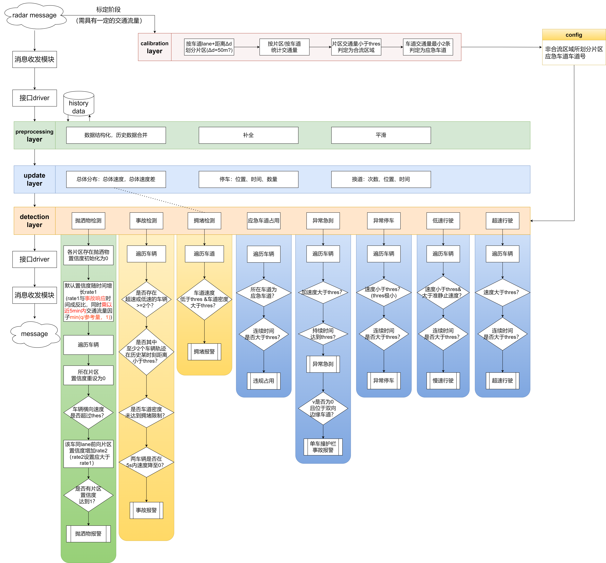

# Spill-Detection
A traffic processing model for detecting abnormal events on highways, using trajectory features and traffic behavior analysis to detect observable spill events and related accidents from video data, as well as non-observable congestion anomalies.

**Core Functionality: Spill Detection**

## 📊 1. Data Overview
### 1.1 Data Source
- **Source**: JinKe Academy, Nanjing Ring Expressway Management Center
- **Scenario**: Nanjing Ring Expressway
- **Device**: Radar
- **Frame Rate**: 20 FPS

### 1.2 Sample Data
- **Road Segment Length**: ~400m
- **Start Timestamp**: 2023-10-20 10:03:41.883
- **Start Frame**: 62748

### 1.3 Sample Data Format
- **Offline Simulation**: Reads from a `.txt` file
- **Per Frame Data**: List of dictionaries representing target information
  - Frame n: `[car1, car2, ...]`
  - Each car dictionary:  
    `TargetId | XDecx | YDecy | ZDecz | VDecVx | VDecVy | Xsize | Ysize | TargetType | Longitude | Latitude | Confidence | EventType | LineNum | Frame`

### 1.4 Deployment Data Format
- **Outer Structure**: `{deviceID, deviceType, targets}`
- **Target Fields**:  
  `timestamp | id | lane | y | x | cls | speed | vx | vy | latitude | longitude`

### 1.5 Data Protocol
See [data protocol](./docs/data_protocol.txt)

## 🚨 2. Detected Event Categories
- 8 event types detected:  
  `["spill", "stop", "lowSpeed", "highSpeed", "emergencyBrake", "incident", "crowd", "illegalOccupation"]`  
  (Spill, Stop, Low Speed, High Speed, Emergency Brake, Incident, Congestion, Illegal Occupation of Emergency Lane)

## 🧠 3. Algorithm Logic
The algorithm processes radar data to detect abnormal traffic events through a series of computational steps. It begins with data ingestion, where raw radar inputs are parsed and normalized. Trajectory analysis tracks vehicle movements using position and velocity data, identifying patterns indicative of events like spills or congestion. Behavioral rules are applied to classify events based on predefined thresholds for speed, braking, and lane usage. The system outputs event classifications, which are validated against historical data to improve accuracy.

## 🏗️ 4. Project Architecture
The project architecture is modular, designed for scalability and real-time processing. It consists of several interconnected components: a data ingestion module that collects radar inputs, a preprocessing unit that cleans and formats data, a core detection engine that applies the algorithm logic, and an output module that delivers event notifications. These components communicate through a message-passing system, ensuring efficient data flow and fault tolerance. Calibration and traffic parameter management are integrated to adapt the system to varying road conditions.

## 📡 5. Data Pipeline
- **Pipeline Overview**:  
  - **Kafka Consumer** receives messages from Kafka.
  - **Input Driver** processes incoming data.
  - **Calibrate OK?**: Decision point to check calibration status.
    - If Yes: Proceeds to **Pre-processor** and **Traffic Parameter Manager**.
    - If No: Triggers **Calibration** using `clb.yml`.
  - **Event Detection** identifies events.
  - **Output Driver** sends results via HTTP, producing Events.

## 📜 6. License
This project is licensed under the MIT License - see the [LICENSE](./LICENSE) file for details.